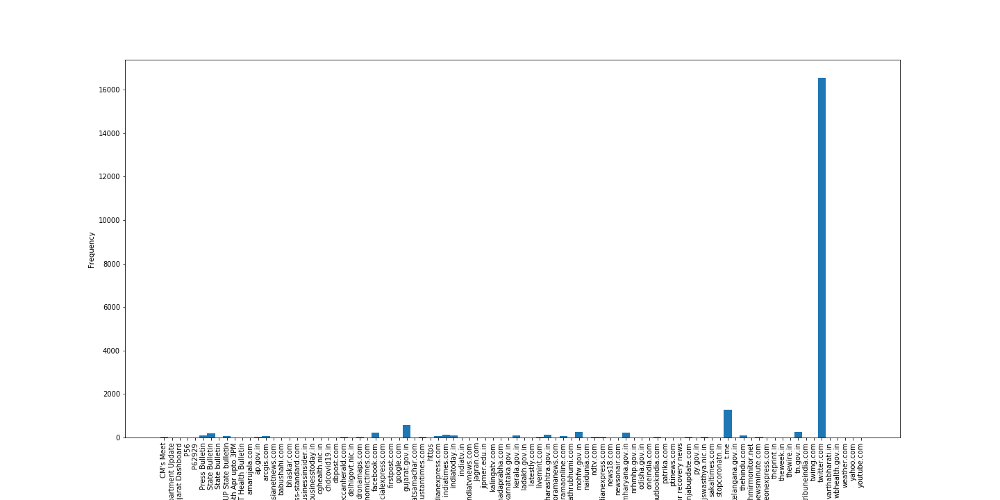

There are two code files
1) covid_analysis-part1.ipynb
2) covid_analysis-part2.ipynb

# COVID 19 ANALYSIS

## Tweets Distribution across channels

## Major source of OSM
<table>
  <tr>
   <td><strong>Category</strong>
   </td>
   <td><strong>Source</strong>
   </td>
   <td><strong>Frequency</strong>
   </td>
  </tr>
  <tr>
   <td>OSM
   </td>
   <td>twitter.com
   </td>
   <td>16358
   </td>
  </tr>
  <tr>
   <td>Govt Website
   </td>
   <td>gujarat.gov.in
   </td>
   <td>574
   </td>
  </tr>
  <tr>
   <td>Instant Messaging
   </td>
   <td>t.me (telegram)
   </td>
   <td>1284
   </td>
  </tr>
</table>

The major information source in the dataset in terms of OSM is twitter with 16358 samples, followed by Facebook with 267 samples.While in other sources it is the  Government of Gujarat with 574 samples then Ministry of Health & Family Welfare with 267 samples.

## Ten most recent posts.

<table>
  <tr>
   <td>Number
   </td>
   <td>Twitter Post
   </td>
  </tr>
  <tr>
   <td>1
   </td>
   <td>#COVID19 cases reach 858 in Telangana including 186 patients who have been cured &amp; 21 deaths: Chief Minister K Chan… https://t.co/PLVR6am2ps
   </td>
  </tr>
  <tr>
   <td>2
   </td>
   <td>Chandigarh update: 

Three family members of Sector 30 woman tested positive 

Total count: 26

#Covid_19

@timesofindia @manuparida1
   </td>
  </tr>
  <tr>
   <td>3
   </td>
   <td>PATIALA:15 new positive cases, all traced to just two previous positive cases.

1. 9 positive cases related to the… https://t.co/q51HQfWOGc
   </td>
  </tr>
  <tr>
   <td>4
   </td>
   <td>Patient Details of #Covid19 #Odisha Case no: 61 

One 58 years Old Male of Balasore District Tested Positive for…<a href="https://t.co/fTn51aD42V"> https://t.co/fTn51aD42V</a>
   </td>
  </tr>
  <tr>
   <td>5
   </td>
   <td>#CoronaVirusUpdates 

#Rajasthan

New  #Covid19 positive cases: 12

Positive cases in #Rajasthan today : 53

#Ajmer…<a href="https://t.co/DtwA7as6bR"> https://t.co/DtwA7as6bR</a>
   </td>
  </tr>
  <tr>
   <td>6
   </td>
   <td>This positive is from Bambooflat. 400+ teams conducting door to door surveillance found him 

He should have report…<a href="https://t.co/8d65Edv6cP"> https://t.co/8d65Edv6cP</a>
   </td>
  </tr>
  <tr>
   <td>7
   </td>
   <td>Out of the 7 deaths today, 5 were men and 2 were women. 4 of them aged over 60 years and 3 were from the age group…<a href="https://t.co/bF2m13UNZI"> https://t.co/bF2m13UNZI</a>
   </td>
  </tr>
  <tr>
   <td>8
   </td>
   <td>286 more #COVID19 cases &amp; 7 deaths (4 in Pune &amp; 3 in Mumbai) reported in Maharashtra today, taking the total number…<a href="https://t.co/rGP1br1oom"> https://t.co/rGP1br1oom</a>
   </td>
  </tr>
  <tr>
   <td>9
   </td>
   <td>Covid-19: 7  more  tests positive in Kerala today

Kannur -4

Kozhikode -2 

Kasargod -1

കേരളത്തിൽ  ഇന്ന്  7  പേർക്ക്…<a href="https://t.co/bTU2S2rpSL"> https://t.co/bTU2S2rpSL</a>
   </td>
  </tr>
  <tr>
   <td>10
   </td>
   <td>#Gujarat #CoronaVirusUpdates #Gujaratcorona

રાજ્યમાં સવાર થી સાંજ સુધીમા #COVID19 ના વધુ 71 નવા કેસ નોંધાયા જેમાં…<a href="https://t.co/WenuCSXh3z"> https://t.co/WenuCSXh3z</a>
   </td>
  </tr>
</table>

## Wordcloud
The most prominent words in the word-cloud are:  \
covid19, tested positive, case, coronavirus, today, new, update, number, district, travel, history, Gujarat

The following is an image of the word-cloud:

## PII
The total tweets from verified accounts are 128. The total tweets from unverified accounts are 42. For the unverified accounts the following statistics have been accumulated:

Average statuses per person are approximately 43365.

Average likes per post per person are almost 1 like per post.

Average followers are 37503.

Average difference between followers and following is 50. 

Given these statistics the unverified sources are fairly reliable. This is because the number of average statuses is high and so is the number of average followers. However, it is important to keep in mind that these statistics are cumulative in nature and thus, may not show the real picture. For further analysis, we picked the following accounts:

1. @IPRTelangana:  \
Total statuses: 11383

    Total followers: 16386 \
Total friends: 14

    Average likes per post: Almost 0 \
The handle seems reliable. It has a professional look. It is associated with the IPR Department of Telangana and has 16.3k followers. . The cover photo contains pictures of members of the organisation which increases accountability of the handle. The COVID19 posts by this account would probably be credible and worthy of attention. 

2. @kansalrohit69:  \
Total statuses: 405

    Total followers: 128448 \
Total friends: 302

    Average likes per post: Almost 0 likes \
The account belongs to an individual who, according to his Twitter Bio is an IAS Civil Servant. His qualifications include LSE London and IIM Kolkata. He is now a member of the Planning and Information, J&K. His credentials are noteworthy and his account is accompanied with his photographs. The pictures seem to support his Twitter bio information by depicting him as a speaker at the Global Investors’ Submit. Replies to his posts include those from verified Twitter accounts. Over-all the information shared by this individual may be believed. 

3. @wilson_thehindu:

    Total statuses: 1143

    Total followers: 882 \
Total friends: 334

    Average likes per post: Almost 0 likes

    This individual is a journalist at the Hindu. He is from Tamil Nadu, India. He has a decent number of followers and following. He has received replies from verified accounts. Since he is associated with a News Agency, the information posted by him would be trustworthy. We can presume that he would have access to correct data.

4. @nagarkoti:

    Total statuses: 7099

    Total followers: 4072

    Total friends: 358

    Average likes per post: Almost 0 likes \
This individual is also a journalist at The Times of India. He has also formerly worked at two other news agencies. He has tagged the official accounts for all these organisations and has even provided a link to the TOI website, that shows his post over there. He has revealed important information like his location. He has tagged the TOI account in all his posts related to coronavirus and has structured his content well, including tables and proper formatting. He has a high number of followers and seems to be a credible source. 

5. @sanjayjavin: \
Total statuses: 1623

    Total followers: 65287

    Total friends: 389

    Average likes per post: 2 likes

    This user is currently the Principal Secretary at the Health Department of Bihar. He is also a part of the IAS. His account has an extremely high number of followers @ 65.4k followers. All his corona virus posts are well structured into tables and one his latest posts has been retweeted by a verified account. We can believe the information shared by him.

identified the PII information from the tweets using the ‘re’ library in python. Detected age, gender, e-mail address, location and phone numbers included in the posts. The following tweets are some of the tweets that were detected.

1. Out of the 7 deaths today, 5 were men and 2 were women. 4 of them aged over 60 years and 3 were from the age group… [https://t.co/bF2m13UNZI](https://t.co/bF2m13UNZI)
2. #COVID_19 - Update on Patient No. 14 - Andhra Pradesh \
Patient 14 (58-year-old male) from Macherla, Guntur District… [https://t.co/x5Khf7p8SH](https://t.co/x5Khf7p8SH)
3. #COVID_19 - Update on Patient No. 15 - Andhra Pradesh \
Patient 15 (21-year-old male) from Macherla, Guntur District… [https://t.co/Vd42gjlheW](https://t.co/Vd42gjlheW)
4. COVID-19 - Update on Patient No. 16 - #AndhraPradesh

A 60 years-old male from Chirala, #Prakasam district has retur… [https://t.co/IQ9r7kIfEK](https://t.co/IQ9r7kIfEK)

5. Today we also recorded a recovery case of patient 3. A man who's a diabetic and hypertensive aged 65 years old who… https://t.co/16zOlrIvKr
6. The latest @COVID19 positive case in the State is a 60 years old male. Contact tracing exercise has commenced. Patient Details of #Covid19 #Odisha Case no: 61 

    One 58 years Old Male of Balasore District Tested Positive for… [https://t.co/fTn51aD42V](https://t.co/fTn51aD42V)

7. One #COVID19 positive patient, Female, 85 years, died in Ahmedabad today. She has travelled abroad and after develo… [https://t.co/juhEZdQt3T](https://t.co/juhEZdQt3T)
8. #COVID19

#JammuAndKashmir 

    Two more positive cases in Srinagar. Siblings (7 years old and 8 months old)- grandchild… https://t.co/0fCKNbr8es

9. SAD NEWS: 7th Death In Punjab due to Corona Virus in Amritsar Hospital. The patient was 75 years old &amp; was a reside… [https://t.co/FO2J0SJ4PG](https://t.co/FO2J0SJ4PG)
10. Recent  update for village Chatamali case , two primary contact… [https://t.co/woOEMoBiBV](https://t.co/woOEMoBiBV)
11. MOHALI-- CLARIFICATORY UPDATE

    The two women who were tested positive yesterday in Mohali:  \
Manjit Kaur (55 years)… [https://t.co/LAopy9tHDu](https://t.co/LAopy9tHDu)

12. KAPURTHALA UPDATE for the TJ man who tested positive YESTERDAY. He is 17-year old boy and was residing in village… [https://t.co/c7gi08hsmb](https://t.co/c7gi08hsmb)
13. MOGA-- One tests Positive \
A Muslim man, 35 years old from V. Cheeda of tehsil Baghapurana tests +ve. Not strictly… [https://t.co/0pHeehZPsy](https://t.co/0pHeehZPsy)
14. BREAKING-- 7 more test cluster POSITIVE in Mohali district. 7 more positive cases from village Jawaharpur, tehsil… [https://t.co/nKEFPnwMKD](https://t.co/nKEFPnwMKD)

### Percentage of tweets that matched with the location column = 25.806784 
### Percentage of tweets that matched with the notes column  = 12.227034
## The user @ANI has the maximum number of COVID19 posts. It is a verified handle.
